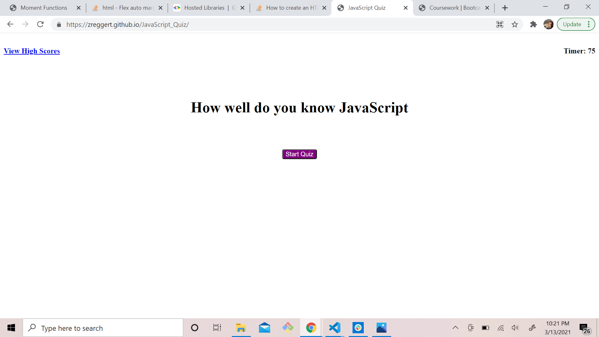
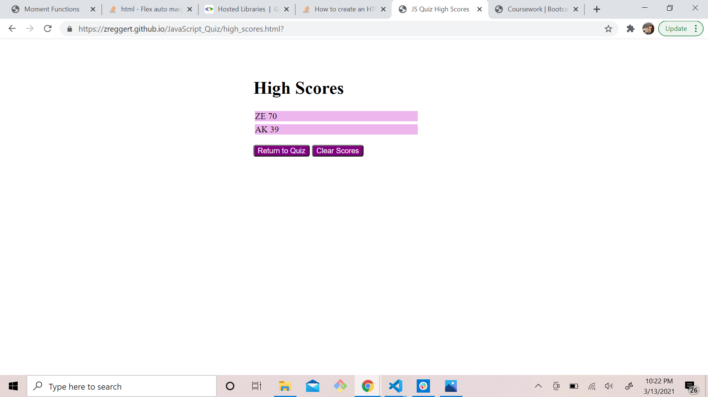

## JavaScript Quiz

## Description

In this project I will create a quiz using DOM manipulation to test the user's knowledge of JavaScript. The elements of this project will consis of a header, a main body with a section for the questions and multiple choice answers, a section for a timer, and a section to keep track of the user's score. When the user intiates the quiz the timer will begin to count down a the first question will appear on the screen. If the user answers correctly, the score will increase, and if answered incorrectly time will be deducted from the remaining time by 15 seconds. Once the time gets to 0 or all questions have been answered, the user will but able to input their initials and save their score to the High Scores page. There will be a link to another page that will keep track of all past scores of users who have taken the quiz.

I have attached pictures of the landing page for the quiz as well as the picture of the high scores page.

Deployed page:
https://zreggert.github.io/JavaScript_Quiz/

